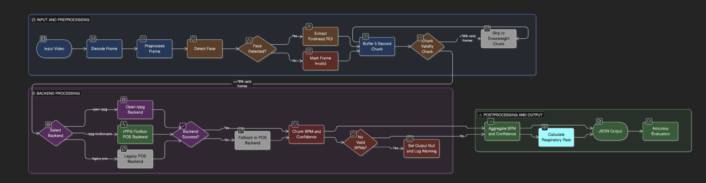

# Near Real-Time rPPG Pipeline

> Contactless heart-rate and respiratory-rate estimation from face video, processed in 5-second incremental chunks using the Open-rppg FacePhys model family.

---

## Quick Results

| Metric | Value |
|---|---|
| **Final BPM** | 94.21 bpm |
| **Respiratory Rate** | 15.0 brpm |
| **Realtime Factor** | 1.362× |
| **Effective FPS** | 34.05 fps |
| **Avg Chunk Latency** | 628.4 ms |
| **P95 Chunk Latency** | 717.3 ms |

---

## Table of Contents

- [Overview](#overview)
- [Pipeline](#pipeline)
- [Architecture](#architecture)
- [Setup](#setup)
- [Usage](#usage)
- [Accuracy Framework](#accuracy-framework)
- [Performance Metrics](#performance-metrics)
- [Failure Modes](#failure-modes)
- [Code Organization](#code-organization)
- [References](#references)
- [AI Disclosure](#ai-disclosure)
- [Deliverables](#deliverables)

---

## Overview

This project implements a near real-time remote photoplethysmography (rPPG) system that processes face video in 5-second windows and outputs per-chunk BPM, a final session BPM, respiratory rate, and runtime performance metrics.

**Integrated model stack:** [Open-rppg](https://github.com/KegangWangCCNU/open-rppg) · `rppg.Model('FacePhys.rlap')`

---

## Pipeline

```
Video Input (60s)
      │
      ▼
┌─────────────────────┐
│  Face Detection      │  OpenCV Haar Cascade
│  ROI Extraction      │  Forehead crop + coverage tracking
└────────┬────────────┘
         │  5-second windows
         ▼
┌─────────────────────┐
│  Model Inference     │  Open-rppg (FacePhys.rlap)
│                      │  → chunk BPM + confidence score
└────────┬────────────┘
         │
         ▼
┌─────────────────────┐
│  Robust Aggregation  │  Confidence-weighted averaging
│                      │  Outlier down-weighting
└────────┬────────────┘
         │
         ▼
┌─────────────────────┐
│  Respiratory Rate    │  Model output → PSD fallback
└────────┬────────────┘
         │
         ▼
  JSON Output + Metrics
```

---

## Architecture

[text](demo/demo.webm)

### Computer Vision Layer
- OpenCV Haar Cascade face detector
- Forehead ROI extraction per frame
- Valid-face coverage tracking across chunks

### Physiological Model Layer
- Open-rppg backend (`FacePhys.rlap` default)
- Chunk-level inference returning BPM and confidence

### Temporal Aggregation Layer
- Non-overlapping 5-second chunking
- Confidence-aware robust aggregation for final BPM

### Metrics & Evaluation Layer
- Throughput, latency, and realtime-factor logging
- Ground-truth and proxy-quality evaluation modes
- JSON artifact serialization

---

## Setup

**Requirements:** Python 3.10+, macOS / Linux / Windows

### Install

```bash
python3 -m pip install -r requirements.txt
```

Core dependencies: `numpy`, `scipy`, `opencv-python`, `open-rppg`

> Optional (`run_application.py` only, not needed for the chunked prototype): `pypylon`, `PyQt5`, `pyqtgraph`, `scikit-image`

### Verify Dependencies

```bash
python3 - <<'PY'
import cv2, numpy as np
from scipy import signal
import rppg
print("dependency check: ok")
PY
```

---

## Usage

### Run Chunked Inference

```bash
python3 run_chunked_prototype.py \
  --video input/assignment_60s.mp4 \
  --chunk-sec 5 \
  --model-backend open-rppg \
  --open-rppg-model FacePhys.rlap \
  --json-out notes/chunked_rppg_output.json
```

### Evaluate — No Ground Truth

```bash
python3 evaluate_accuracy.py \
  --pred notes/chunked_rppg_output.json \
  --out  notes/accuracy_report.json
```

### Evaluate — With Ground-Truth HR and RR

```bash
cp notes/reference_hr_template.csv notes/reference_hr.csv

python3 evaluate_accuracy.py \
  --pred        notes/chunked_rppg_output.json \
  --ref-bpm-csv notes/reference_hr.csv \
  --ref-rr      14.8 \
  --out         notes/accuracy_report_with_gt.json
```

### One-Command Demo

```bash
python3 -m pip install open-rppg && \
python3 run_chunked_prototype.py \
  --video input/assignment_60s.mp4 --chunk-sec 5 \
  --model-backend open-rppg --open-rppg-model FacePhys.rlap \
  --json-out notes/chunked_rppg_output.json && \
python3 evaluate_accuracy.py \
  --pred notes/chunked_rppg_output.json \
  --out  notes/accuracy_report.json
```

---

## Accuracy Framework

Evaluation operates at three levels: chunk predictions, session aggregation, and runtime behavior.

### Metrics (with ground truth)

| Metric | Formula |
|---|---|
| MAE | `(1/N) Σ \|ŷᵢ − yᵢ\|` |
| RMSE | `√( (1/N) Σ (ŷᵢ − yᵢ)² )` |
| MAPE | `(100/N) Σ \|ŷᵢ − yᵢ\| / yᵢ` |
| Threshold Acc ±k | `(100/N) Σ 𝟙(\|ŷᵢ − yᵢ\| ≤ k)` for k ∈ {3, 5, 10} bpm |
| Pearson r | `corr(ŷ, y)` |
| Session error | `\|BPM_pred − BPM_ref\|` |
| RR error | `\|RR_pred − RR_ref\|` |

### Proxy Quality (without ground truth)

When no reference is available, the evaluator reports:

- Median confidence score
- Chunk BPM standard deviation
- BPM interquartile range
- Outlier chunk ratio

> **Note:** `notes/reference_hr_template.csv` is a small workflow-validation sample. For trustworthy benchmarks, replace it with a larger manually annotated dataset.

---

## Performance Metrics

| Field | Description | Sample Value |
|---|---|---|
| `wall_time_sec` | Total end-to-end wall time | — |
| `avg_chunk_compute_ms` | Mean per-chunk inference latency | 628.4 ms |
| `p95_chunk_compute_ms` | 95th-percentile chunk latency | 717.3 ms |
| `effective_pipeline_fps` | End-to-end throughput | 34.05 fps |
| `realtime_factor_x` | `video_duration / wall_time` (≥ 1.0 = real-time) | 1.362× |
| `face_detection_coverage` | Fraction of frames with valid face | — |

RTF ≥ 1.0 confirms at-least-real-time throughput.

---

## Failure Modes

- **Motion & pose** — Fast head movement and large pose changes reduce per-chunk stability and confidence.
- **Illumination** — Flicker and compression artifacts degrade the rPPG signal.
- **Short windows** — 5-second chunks improve responsiveness but increase BPM variance.
- **Latency vs. accuracy** — The deep model backend improves physiological modelling but raises per-chunk compute time.
- **Production hardening** — Deployments should apply confidence gating and graceful fallback for low-quality frames.

---

## Code Organization

```
.
├── run_chunked_prototype.py      # Entry point — chunked pipeline CLI
├── evaluate_accuracy.py          # Accuracy evaluator (GT + proxy modes)
├── requirements.txt              # Core dependencies
├── src/
│   ├── open_rppg_backend.py      # Open-rppg model adapter
│   └── rppg_toolbox_pos.py       # Alternate POS signal backend
├── input/
│   └── assignment_60s.mp4
└── notes/
    ├── chunked_rppg_output.json          # Primary inference output
    ├── chunked_rppg_output_open_rppg.json
    ├── accuracy_report.json              # Proxy-quality evaluation
    ├── accuracy_report_with_gt.json      # GT evaluation
    └── reference_hr_template.csv
```

---

## References

- [Open-rppg](https://github.com/KegangWangCCNU/open-rppg) — primary integrated model backend (FacePhys family)
- [rPPG-Toolbox](https://github.com/ubicomplab/rPPG-Toolbox) — alternate signal processing reference
- [heartbeat](https://github.com/prouast/heartbeat) — lightweight rPPG reference implementation
- [Meta-rPPG](https://github.com/eugenelet/Meta-rPPG) — meta-learning rPPG approach

---

## AI Disclosure

AI tools were used extensively throughout this project, including for:

- Chunked pipeline architecture and CLI design (`run_chunked_prototype.py`)
- Open-rppg model adapter implementation (`src/open_rppg_backend.py`)
- Confidence-aware aggregation and evaluation warnings (`evaluate_accuracy.py`)
- Chunk outlier rejection logic tuning
- Accuracy framework definition and metrics selection
- README structure and reproducibility documentation

---

## Deliverables

- [x] Integrated CV + rPPG model pipeline
- [x] 5-second incremental chunk processing
- [x] Chunk BPM and final session BPM outputs
- [x] Runtime and performance metrics
- [x] Respiratory rate estimation with frequency-domain fallback
- [x] Formal accuracy protocol with GT and proxy-quality modes
- [x] Reproducible commands and structured documentation